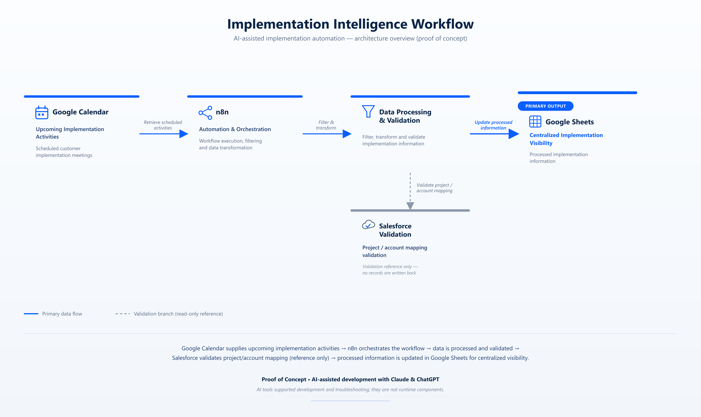
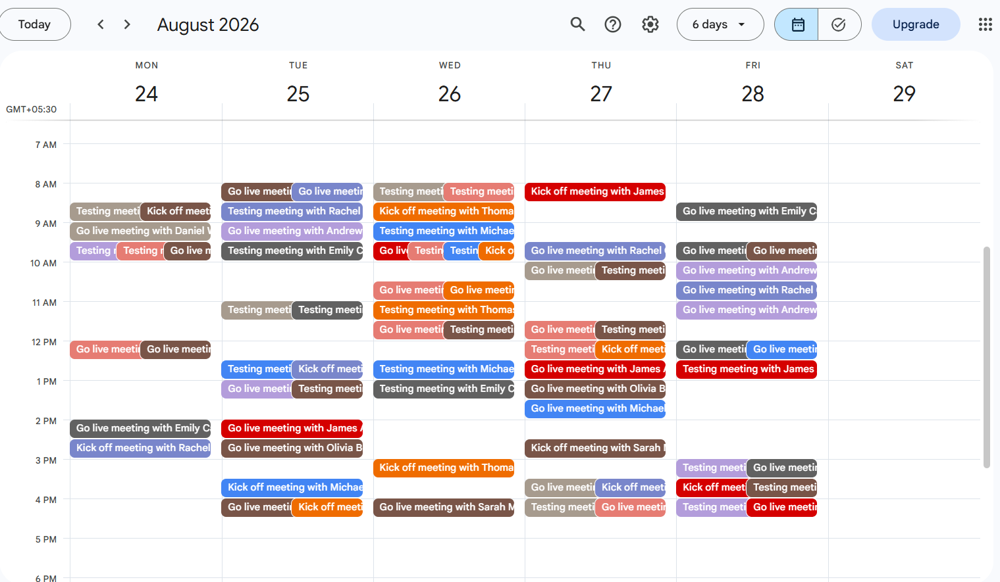
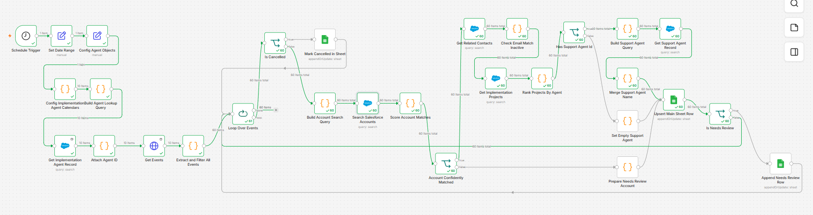
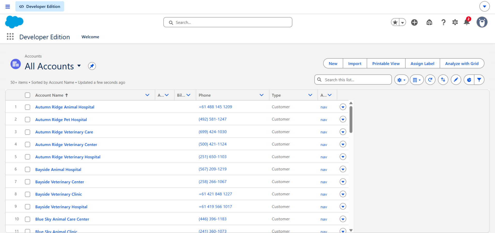
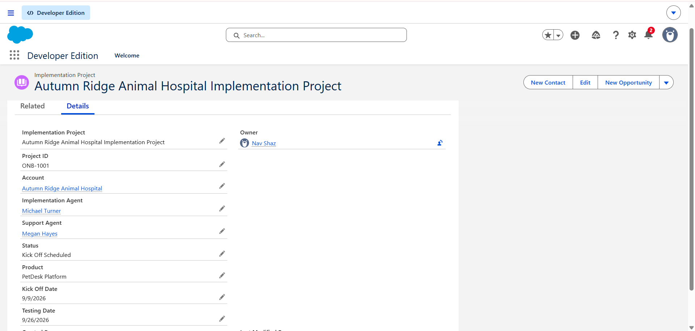
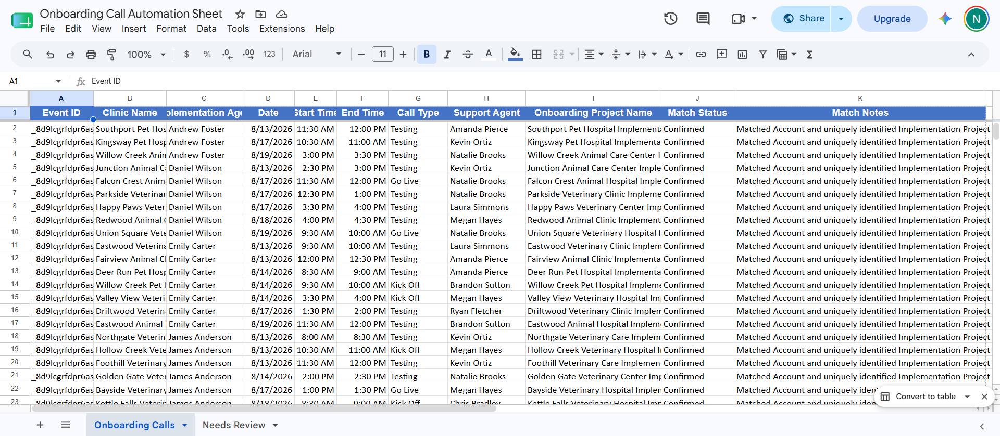

# AI-Assisted Implementation Intelligence Workflow

An AI-assisted automation prototype designed to reduce manual preparation work for SaaS Implementation Engineers by connecting Google Calendar, n8n, Salesforce, and Google Sheets.

## Overview

In my role as a Product Implementation Engineer, I identified a repetitive workflow where Implementation Engineers manually reviewed upcoming Salesforce projects before scheduled customer meetings.

I designed and built a proof of concept to automate this preparation process and provide earlier visibility into upcoming implementation work.

The workflow uses n8n to orchestrate data between Google Calendar, Salesforce, and Google Sheets, with Claude and ChatGPT used as AI-assisted development and problem-solving tools.

## The Problem

Before the automation, preparing for upcoming implementation activities required manually reviewing scheduled meetings and associated project information.

This created:

- Repetitive manual work
- Time spent reviewing multiple sources
- Risk of missing preparation tasks
- Limited visibility into upcoming implementation workload
- Less time available for customer-focused implementation work

## The Solution

I designed an automated workflow that:

1. Retrieves upcoming implementation activities from Google Calendar
2. Filters relevant implementation meetings
3. Processes and transforms the meeting information
4. Validates relevant Salesforce project and account mappings
5. Updates the processed information in Google Sheets
6. Provides a centralized view of upcoming implementation activities

### High-Level Architecture

Google Calendar  
↓  
n8n Automation  
↓  
Data Processing & Validation  
↓  
Salesforce Validation  
↓  
Google Sheets

## AI-Assisted Development

AI was incorporated into the development process using Claude and ChatGPT as development and problem-solving assistants.

I used AI to help:

- Explore implementation approaches
- Develop and refine workflow logic
- Troubleshoot API and data-processing issues
- Generate and refine code where required
- Validate technical approaches
- Improve documentation

The overall problem definition, workflow architecture, integration approach, testing, validation, and implementation decisions were designed and validated by me.

The project demonstrates how I use AI to accelerate technical implementation work rather than treating AI as a replacement for engineering judgment.

## My Contribution

I independently designed and built the proof of concept.

My contribution included:

- Identifying the manual workflow bottleneck
- Designing the solution architecture
- Creating and configuring a Salesforce Developer environment
- Preparing sample Salesforce project and account data
- Configuring the n8n automation workflow
- Connecting Google Calendar and downstream services
- Working with REST APIs and JSON
- Designing filtering and validation logic
- Validating Salesforce project and account mappings
- Updating the resulting information in Google Sheets
- Testing the workflow using sample data
- Troubleshooting integration issues
- Using Claude and ChatGPT for AI-assisted development
- Documenting the solution architecture and workflow

## Results

The proof of concept was able to process and review more than:

### 60+ projects in under 8 minutes

This demonstrated that a repetitive manual review process could be significantly accelerated through automation.

### Key outcomes

- **60+ projects processed**
- **Under 8 minutes** for the automated review
- Reduced repetitive preparation work
- Improved visibility into upcoming implementation activities
- Enabled earlier preparation for scheduled customer meetings

Success was measured not only by whether the automation executed successfully, but also by whether the resulting information was accurate, useful, and available to Implementation Engineers in a centralized format.

## Technology Stack

- **n8n** — workflow orchestration and automation
- **Salesforce Developer Environment** — project and account validation
- **Google Calendar API** — scheduled implementation activity
- **Google Sheets** — centralized output and visibility
- **REST APIs** — system integration
- **JSON** — data processing
- **Claude** — AI-assisted development
- **ChatGPT** — AI-assisted development and troubleshooting

## What I Learned

This project reinforced the importance of designing automation around the actual operational workflow rather than simply connecting systems.

The most important considerations were:

- Understanding the workflow before automating it
- Defining reliable validation rules
- Handling data from multiple systems
- Designing clear data flows
- Testing with realistic sample data
- Using AI to accelerate development while maintaining human validation
- Measuring automation by business impact, not simply successful execution

## Project Status

**Proof of Concept**

This project was created as an independent portfolio project to demonstrate implementation engineering, SaaS integrations, automation, API integration, Salesforce, and AI-assisted development capabilities.

It is not presented as a production deployment.

## Case Study

A more detailed interactive version of the project is available here:

**[View the full interactive case study](https://salesforce-sync-automation-case-studyzip-1--naveenasahasra3.replit.app/)**

The case study includes the solution architecture, workflow, build process, screenshots, and impact.

## Security & Data Handling

This repository is intended for public demonstration only.

No production credentials, API keys, access tokens, customer information, or confidential company data are included.

Any screenshots and sample datasets shared publicly are sanitized, anonymized, or recreated using demonstration data.

## Key Takeaway

This project represents how I approach implementation problems:

**Identify the operational bottleneck → understand the workflow → design the technical solution → integrate systems → use AI to accelerate development → validate the output → measure the impact.**

## Implementation Evidence

### Solution Architecture

Overview of how the systems work together across the implementation workflow.

### Google Calendar Environment

Sample implementation activities used as the workflow input.

### n8n Automation Workflow

The n8n workflow orchestrating data retrieval, processing, validation, and output.

### Salesforce Developer Environment

Sample Salesforce environment used to validate implementation project and account mappings.

### Google Sheets Output

Processed implementation information centralized in Google Sheets.

